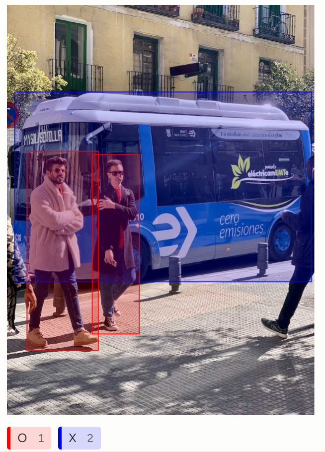

# Training Autoaudiogram Process


## Setup

Install the packages with [uv](https://docs.astral.sh/uv/getting-started/installation/).
```bash
uv venv
source .venv/bin/activate
uv sync
```


## Quick Run

Run the code below and open it on [http://localhost:7860](http://localhost:7860).
```py
python app.py
```


## [YOLO26](https://docs.ultralytics.com/models/yolo26/) Usage Example

This section provides simple YOLO26 training and inference examples. For full documentation on these and other modes, see the Predict, Train, Val, and Export docs pages.
Note that the example below is for YOLO26 Detect models for object detection. For additional supported tasks, see the Segment, Classify, OBB, and Pose docs.

```py
from ultralytics import YOLO
# Load a COCO-pretrained YOLO26n model
model = YOLO("yolo26n.pt")
# Train the model on the COCO8 example dataset for 100 epochs
results = model.train(data="coco8.yaml", epochs=100, imgsz=640)
# Run inference with the YOLO26n model on the 'bus.jpg' image
results = model("path/to/bus.jpg")
```


## Data Collection

For the data collection, we use [Label Studio](https://labelstud.io/) for labeling.
1. Install Label Studio:
```bash
pip install label-studio
```
2. Start Label Studio:
```bash
label-studio start
```
3. Open Label Studio at http://localhost:8080.
4. Click Create to create a project and start labeling data.
5. Click Data Import and upload the images that you want to label.
6. Click Labeling Interface in Settings and choose a template for your use case. For example:
```
<View>
  <Image name="image" value="$image"/>
  <RectangleLabels name="label" toName="image">
    <Label value="O" background="red"/>
    <Label value="X" background="blue"/>
  </RectangleLabels>
</View>
```

7. Export data as YOLO with Images.


## Folder Structure

Organize the data as follows:
```
autoaudiogram
|__data
   |__images
      |__train
         |__1.jpg
      |__val
         |__2.jpg
   |__labels
      |__train
         |__1.txt
      |__val
         |__2.txt
|__config.yaml
|__train.py
```

Prepare a yaml file like this:
```
# Dataset root directory
path: ../data

# Relative paths to image directories
train: images/train 
val: images/val 
test:  # optional

# Class names dictionary
names:
  0: person
  1: bus
```


## Training

Run `python yolo.py` to train a detection model. You can change the input and output path in the function `yolo_train()`.

## Inference

Run `python detect.py` for inference. Remember to change the `Model path` and `Input image path` into yours.