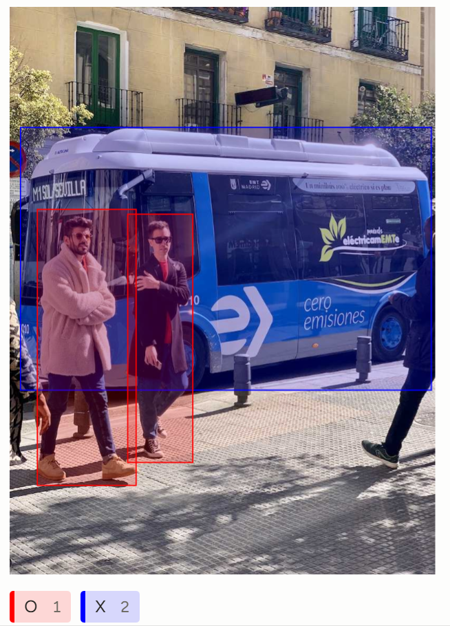

# AutoAudiogram

An automatic audiogram analysis system that detects audiogram symbols, extracts patient information using OCR, and stores the results into a database.

## Features

🎯 Audiogram symbol detection using YOLO26

📝 OCR support

- EasyOCR

- RapidOCR

- PaddleOCR

- PaddleOCR-VL

- HunyuanOCR

👤 Fake patient information generation

💾 SQLite database management

📊 OCR accuracy validation

🌐 Gradio web interface

## Project Structure

```
AutoAudiogram/
│
├── app.py
├── config.yaml
├── db.db
│
├── data/
│
├── models/
│
├── outputs/
│   ├── debug/
│   ├── images/
│   └── ocr/
│
├── scripts/
│   └── ocr/
|
├── src/
│
└── README.md
```

## Setup

Install dependencies using [uv](https://docs.astral.sh/uv/getting-started/installation/).

```bash
uv venv
source .venv/bin/activate
uv sync
```

## Quick Run

Run the code below and open it on [http://localhost:7860](http://localhost:7860).

```py
python app.py
```

# Object Detection

## [YOLO26](https://docs.ultralytics.com/models/yolo26/) Usage Example

This section provides simple YOLO26 training and inference examples. For full documentation on these and other modes, see the Predict, Train, Val, and Export docs pages.

Note that the example below is for YOLO26 Detect models for object detection. For additional supported tasks, see the Segment, Classify, OBB, and Pose docs.

```py
from ultralytics import YOLO
# Load a COCO-pretrained YOLO26n model
model = YOLO("yolo26n.pt")
# Train the model on the COCO8 example dataset for 100 epochs
results = model.train(data="coco8.yaml", epochs=100, imgsz=640)
# Run inference with the YOLO26n model on the 'bus.jpg' image
results = model("path/to/bus.jpg")
```

## Data Collection

For the data collection, we use [Label Studio](https://labelstud.io/) for labeling.

1. Install Label Studio:

```bash
pip install label-studio
```

2. Start Label Studio:

```bash
label-studio start
```

3. Open Label Studio at http://localhost:8080.
4. Click Create to create a project and start labeling data.
5. Click Data Import and upload the images that you want to label.
6. Click Labeling Interface in Settings and choose a template for your use case. For example:

```
<View>
  <Image name="image" value="$image"/>
  <RectangleLabels name="label" toName="image">
    <Label value="O" background="red"/>
    <Label value="X" background="blue"/>
  </RectangleLabels>
</View>
```


7. Export data as YOLO with Images.

## Folder Structure

Organize the data as follows:

```
Data/
│
├── images/
│   ├── train/
│   │   └── 1.jpg
│   └── val/
│       └── 2.jpg
|
└── labels/
    ├── train/
    │   └── 1.txt
    └── val/
        └── 2.txt
```

Prepare a yaml file like this:

```
# Dataset root directory
path: ../data

# Relative paths to image directories
train: images/train
val: images/val
test:  # optional

# Class names dictionary
names:
  0: person
  1: bus
```

## Running

Train YOLO model

```bash
python src/yolo.py
```

Run inference

```bash
python src/detect_symbol.py
```

# OCR

Supported OCR engines, setup the below 3 larger models by yourself if you want to use them.

- EasyOCR

- RapidOCR

- [PaddleOCR](https://www.paddleocr.ai/latest/en/version3.x/pipeline_usage/OCR.html)

- [PaddleOCR-VL](https://www.paddleocr.ai/latest/en/version3.x/pipeline_usage/PaddleOCR-VL.html)

- [HunyuanOCR](https://github.com/Tencent-Hunyuan/HunyuanOCR#-quick-start-with-vllm--recommended)

## Database

Patient information is stored in SQLite.

Tables

- patient

- patient_case

Setup database

```bash
python -m scripts.db
```

## Fake Data Generation

Generate fake patient information for OCR evaluation, put your images inside `/data/raw`.

```bash
python -m scripts.add_fake_data
```

Generated fields

- Doctor

- Patient

- Serial Number

## Validation

Evaluate OCR performance, change the model in line 84-88 in `/scripts/validate_ocr.py`.

```bash
python -m scripts.validate_ocr
```
